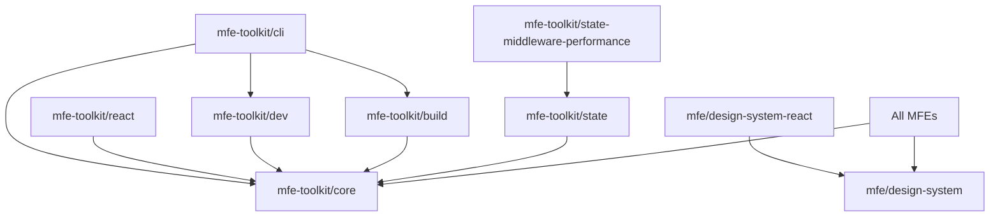

# MFE Toolkit Packages

Documentation for all published and internal packages in the MFE Toolkit ecosystem.

## Published NPM Packages

### Core Packages

#### [@mfe-toolkit/core](./core/)
Framework-agnostic core functionality including types, services, utilities, and the build system.

#### [@mfe-toolkit/dev](./dev/) 🧪
Standalone development server with integrated dev tools for independent MFE development.
- Mock services for all container dependencies
- Interactive dev tools panel
- Hot reload support
- Viewport and theme testing

#### [@mfe-toolkit/react](./react/)
React-specific components, hooks, and adapters for building React MFEs.

#### [@mfe-toolkit/cli](./cli/)
Command-line tools for scaffolding and managing MFEs.
- Create new MFEs with templates
- Validate manifests
- Generate configurations

### State Management

#### [@mfe-toolkit/state](./state/)
Cross-framework state management solution with:
- Proxy-based reactivity
- Cross-tab synchronization
- Persistence support
- Middleware system

#### [@mfe-toolkit/state-middleware-performance](./state-middleware-performance/)
Performance monitoring middleware for state management.
- Track state update metrics
- Memory usage monitoring
- Render count tracking
- Performance analytics

### Build Tools

#### [@mfe-toolkit/build](./build/)
Advanced build system with automatic dependency management.
- Automatic dependency externalization
- Import map generation
- Library versioning strategy
- ESBuild integration

## Internal Packages

### Design System

#### [@mfe/design-system](./design-system/)
Framework-agnostic CSS-first design system.
- 500+ utility classes with `ds-*` prefix
- Zero JavaScript pollution
- Modern Blue & Slate palette
- Responsive utilities

#### [@mfe/design-system-react](./design-system-react/)
React component wrappers for the design system.
- Hero, MetricCard, TabGroup components
- EmptyState and LoadingState components
- EventLog and notification components

### Utilities

#### [@mfe/shared](./shared/)
Internal shared utilities and constants for demo applications.

## Package Development Guidelines

### Version Management

All packages follow semantic versioning:
- **Major**: Breaking changes
- **Minor**: New features (backward compatible)
- **Patch**: Bug fixes

### Publishing Process

1. Update package version in package.json
2. Update CHANGELOG.md
3. Build the package: `pnpm build`
4. Test locally: `pnpm test`
5. Publish: `npm publish`

### Package Structure

```
packages/
├── mfe-toolkit-{name}/
│   ├── src/           # Source code
│   ├── dist/          # Built output
│   ├── README.md      # Package documentation
│   ├── package.json   # Package manifest
│   ├── tsconfig.json  # TypeScript config
│   └── tsup.config.ts # Build configuration
```

### Development Scripts

All packages support these scripts:
- `pnpm build` - Build the package
- `pnpm test` - Run tests
- `pnpm lint` - Lint code
- `pnpm type-check` - Check TypeScript types

## Installation

### Installing Individual Packages

```bash
# Core functionality
npm install @mfe-toolkit/core

# Development server
npm install -D @mfe-toolkit/dev

# React support
npm install @mfe-toolkit/react

# CLI tools
npm install -g @mfe-toolkit/cli

# State management
npm install @mfe-toolkit/state
npm install @mfe-toolkit/state-middleware-performance
```

### Using Workspace Packages

In the monorepo, packages reference each other using workspace protocol:

```json
{
  "dependencies": {
    "@mfe-toolkit/core": "workspace:*"
  }
}
```

## Package Dependencies



## Quick Links

- [Getting Started Guide](../../GETTING_STARTED.md)
- [Architecture Documentation](../../architecture/)
- [API Reference](../../api/)
- [Contributing Guide](../../../CONTRIBUTING.md)