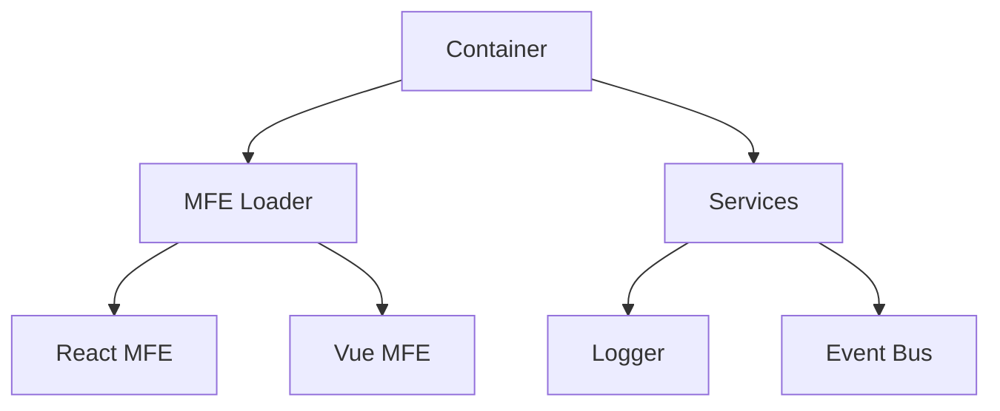

# Documentation Style Guide

This guide ensures consistency across all documentation in the MFE Toolkit project.

## File Naming Conventions

### Markdown Files

1. **Root-level standard files** - Use UPPERCASE for widely recognized files:
   - `README.md` - Project overview
   - `LICENSE` or `LICENSE.md` - License information
   - `CHANGELOG.md` - Version history
   - `CONTRIBUTING.md` - Contribution guidelines
   - `CODE_OF_CONDUCT.md` - Community guidelines
   - `SECURITY.md` - Security policies

2. **All other documentation** - Use kebab-case (lowercase with hyphens):
   - ✅ `architecture-decisions.md`
   - ✅ `state-management-guide.md`
   - ✅ `mfe-loading-guide.md`
   - ❌ `ARCHITECTURE_DECISIONS.md`
   - ❌ `StateManagementGuide.md`

3. **Special files** - Some files may use specific casing:
   - `claude.md` - AI assistant instructions (lowercase)
   - Version files like `v1.0.0.md` (lowercase with dots)

### Directory Names

Always use kebab-case for directories:
- ✅ `container-spec/`
- ✅ `platform-docs/`
- ❌ `Container_Spec/`
- ❌ `PlatformDocs/`

## Content Formatting

### Headings

- Use title case for main headings (H1)
- Use sentence case for subheadings (H2 and below)

```markdown
# MFE Toolkit Documentation    <!-- Title case -->
## Getting started             <!-- Sentence case -->
### Install dependencies       <!-- Sentence case -->
```

### Code Examples

- Always specify the language for syntax highlighting
- Use meaningful variable names
- Include comments for complex logic

```javascript
// Good
const loadMFE = async (url) => {
  // Dynamic import with error handling
  try {
    const module = await import(url);
    return module.default;
  } catch (error) {
    console.error('Failed to load MFE:', error);
    throw error;
  }
};
```

### Links

- Use relative links for internal documentation
- Use descriptive link text (avoid "click here")
- Verify all links work before committing

```markdown
<!-- Good -->
See the [architecture decisions](./architecture/architecture-decisions.md) for more details.

<!-- Bad -->
Click [here](./architecture/architecture-decisions.md) for more info.
```

## Documentation Structure

### Standard Sections

Most documentation should include:

1. **Title and Overview** - What is this document about?
2. **Table of Contents** - For documents over 500 lines
3. **Prerequisites** - What knowledge/setup is required?
4. **Main Content** - The core documentation
5. **Examples** - Practical usage examples
6. **Troubleshooting** - Common issues and solutions
7. **References** - Links to related documentation

### Metadata

Include metadata at the bottom of significant documents:

```markdown
---

_Last updated: January 2025_  
_Status: Draft | Review | Final_  
_Audience: Developers | Architects | All_
```

## Writing Style

### Tone

- **Professional but approachable** - Avoid overly technical jargon
- **Active voice** - "The container loads MFEs" not "MFEs are loaded by the container"
- **Direct and concise** - Get to the point quickly
- **Inclusive** - Use "we" and "you" appropriately

### Technical Writing Best Practices

1. **Define acronyms on first use**
   - "Microfrontend (MFE)" then use "MFE" thereafter

2. **Use consistent terminology**
   - Choose "container" or "host" and stick with it
   - Create a glossary for complex projects

3. **Provide context**
   - Explain why, not just how
   - Include decision rationale

4. **Use examples liberally**
   - Show don't just tell
   - Include both good and bad examples

## Diagrams

### ASCII Diagrams

For simple diagrams, use ASCII art:

```
Container Application
    ├── MFE Loader
    ├── Services
    │   ├── Logger
    │   ├── Event Bus
    │   └── Auth
    └── MFEs
        ├── React MFE
        └── Vue MFE
```

### Mermaid Diagrams

For complex diagrams, use Mermaid:



## File Organization

### Documentation Hierarchy

```
docs/
├── README.md                    # Documentation overview
├── style-guide.md              # This file
│
├── platform/                   # Framework-agnostic docs
│   ├── README.md
│   ├── architecture/
│   ├── packages/
│   └── roadmap.md
│
├── container-spec/             # Container requirements
│   ├── README.md
│   └── service-contracts.md
│
└── containers/                 # Implementation docs
    ├── README.md
    └── react/
        ├── README.md
        └── architecture/
```

## Maintenance

### Regular Reviews

- Review documentation quarterly
- Update examples when APIs change
- Remove outdated content
- Fix broken links

### Version-Specific Documentation

- Tag documentation for major versions
- Maintain separate docs for breaking changes
- Clearly mark deprecated features

## Tools and Validation

### Markdown Linting

Use markdownlint to ensure consistency:

```bash
# Install
npm install -g markdownlint-cli

# Check all markdown files
markdownlint docs/**/*.md

# Auto-fix issues
markdownlint --fix docs/**/*.md
```

### Link Checking

Verify all links are valid:

```bash
# Install
npm install -g markdown-link-check

# Check links
find docs -name "*.md" -exec markdown-link-check {} \;
```

## Contributing

When contributing documentation:

1. Follow this style guide
2. Run linting before committing
3. Have someone review for clarity
4. Update the table of contents if needed
5. Add your document to relevant indexes

---

_Last updated: January 2025_  
_Status: Final_  
_Audience: All contributors_